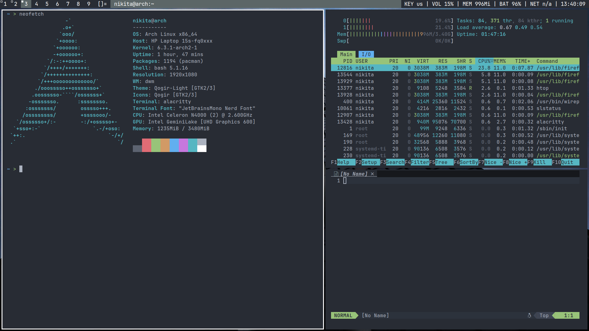

# Screenshots

# Dwm - dynamic window manager

Dwm is an extremely fast, small, and dynamic window manager for X.

# Getting started

Install dunst, lxsession-gtk3, feh, pipewire, xbacklight, flameshot, alacritty JetBrainsMono Nerd Font.
Edit config.mk to match your local setup (dwm is installed into the /usr/local namespace by default).
Afterwards enter the following command to build and install dwm (if necessary as root):

    make clean install

Go to dmenu dir, build and install dmenu (if necessary as root):

    cd dmenu && make clean install

Go to slstatus dir, change in config.def.h battery name (BAT0, BAT1, etc) and wifi interface name (wla0, wlo1 , etc), build and install dmenu (if necessary as root):

    cd slstatus && make clean install

Move autostart.sh to .dwm dir:

    mkdir -p ~/.dwm && mv autostart.sh ~/.dwm

# Running dwm

Add the following line to your .xinitrc to start dwm using startx:

    exec dwm

In order to connect dwm to a specific display, make sure that
the DISPLAY environment variable is set correctly, e.g.:

    DISPLAY=foo.bar:1 exec dwm

(This will start dwm on display :1 of the host foo.bar.)

# Configuration

The configuration of dwm is done by creating a custom config.h
and (re)compiling the source code.
